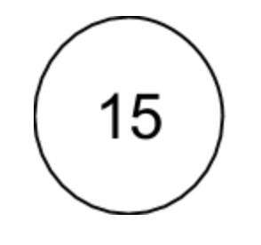
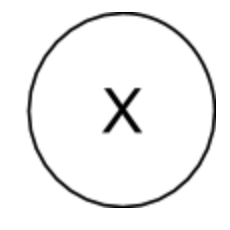
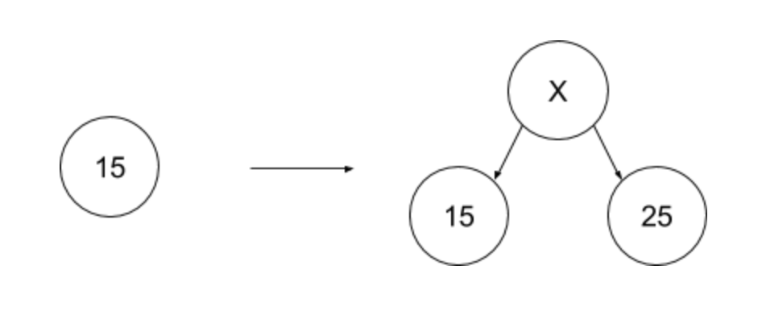
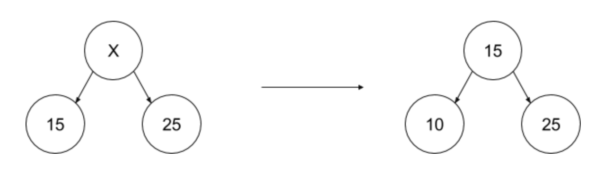

# MHMHTree
A balanced binary search tree implementation

## Introduction
The MHMHTree(MaxHeap-MinHeap Tree) is an implementation of a balanced binary search tree(BST). It balances itself after every insert to not become skewed on one side or another. It builds on the idea of having two heaps, a maxheap for lower half elements in the list, and a minheap of the upper half elements in the list. Then each heap itself is further split into max heap, and min heap, recursively.

## Nodes
There are two types of nodes in the tree.

### Data Nodes
These contain actual user keys. 
These are denoted by a circle with a numeric value in it in the diagrams below.

### Balance Nodes
These nodes don’t contain any user keys.
They are around just to maintain the balance of the tree.
These are denoted by a circle with an ‘X’ mark in it.

## Working
The tree self-balances itself whenever there is an insert or delete, as follows:

### Inserts
Here are the possible scenarios

#### Empty Tree
Create a new data node with user data, left sub-tree is null, right sub-tree is null.

#### Odd number of data nodes
When there are odd number of data nodes in tree, the root node will be a data node, and each of the two sub-trees will have equal number data nodes. Like in the case of 1 data node, the root node is a data node.
If there is an insert in this kind of tree, the inserted data is compared with the medial(root) data and based on comparison result, it gets inserted into one sub-tree, and the data node's data gets inserted into the other sub-tree. The root data node now becomes a balance node.

#### Even number of data nodes
When there are even number of data nodes in tree, the root node will be a balance node, and each of the two sub-trees will have equal number of data nodes.
If there is an insert in this kind of tree, then 
* inserted data is compared with largest child of left sub-tree(max heap). If it is lesser than this child, then 
  * we insert the new data node in left sub-tree
  * remove the largest child in left sub-tree
  * add the data of largest child to the root node, thus making it a data node.
* else, inserted data is compared with smallest child of right sub-tree(min heap). If it is larger than this child, then 
  * we insert the new data node in right sub-tree
  * remove the smallest child in left right sub-tree
  * add the data of smallest child to the root node, thus making it a data node.
* else, we put the inserted data into the root of the tree.

### Deletes
Deletes happen exactly as a reverse of inserts
WIP

### Lookups
WIP
